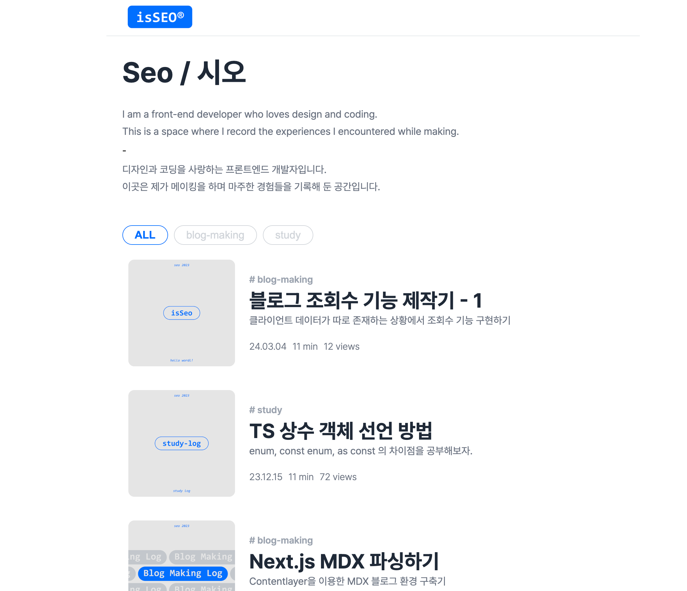
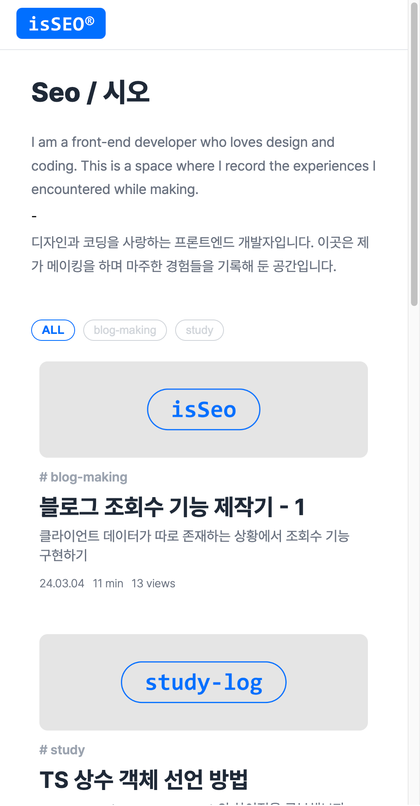
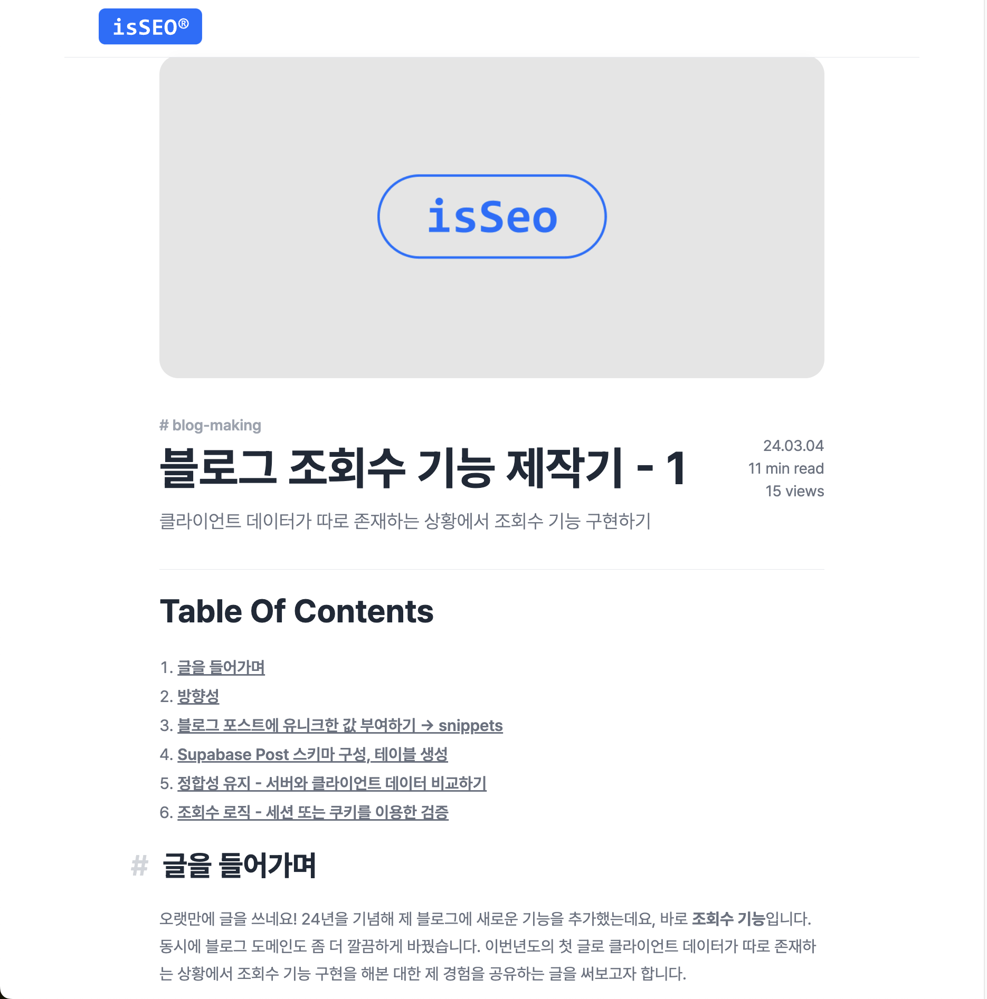
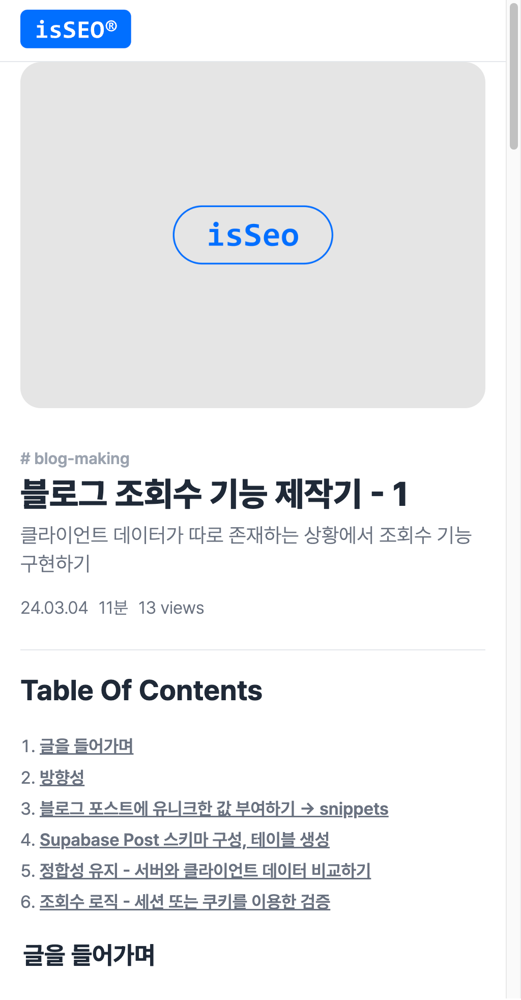

## SEO BLOG

| Main Page - PC                                  | Main Page - Mobile                             |
| ----------------------------------------------- | ---------------------------------------------- |
|  |  |

| Post Page - PC                                  | Post Page - Mobile                              |
| ----------------------------------------------- | ----------------------------------------------- |
|  |  |

## 정보

- [배포 링크](https://blog.seo0h.me/) | [포트폴리오 설명 링크](https://portfolio.seo0h.me/project/blog)
- 사용 스킬 : `TypeScript`, `Next.js`, `Styled-Component`, `MDX`, `Github Page`, `SupaBase`

## 요약

- 개인 블로그 제작 프로젝트
- `mdx` 형식으로 글을 작성하는 블로그
- 23년 8월 ~ 9월 간 개발, 유지보수 중

### 개인 성과

- **조회수 기능** : 쿠키를 이용한 유저 검증, 서버 제작, Supabase 데이터베이스 구현, AWS E2C 와 Docker를 이용한 서버 배포
- **개인 도메인 적용** : API 통신을 위한 개인 도메인 적용. AWS Route 53 을 이용.
- **배포 CICD** : Github Pages를 이용한 Next.js 정적 배포 CI/CD 구현
- **MDX Parsing** : Contentlayer 을 이용한 mdx 파싱
- 글 태그 별 **필터링** 구현
- 기종별 반응형 대응 / SEO / GA

## 프로젝트 구조

### Data Fetching Structure

- `getStaticProps`, `getStaticPaths`를 이용해 정적 데이터를 빌드하였습니다.
- Main Page 의 `getStaticProps` 에서는 서버 데이터인 조회수와 클라이언트 데이터인 포스트의 데이터의 동기화를 진행합니다. ([해당 코드](/src/pages/index.tsx#L16-L27))
- Post Page 의 `getStaticPath`, `getStaticProp` 에서는 각각 블로그 포스트의 정적인 경로를 생성하고, 생성된 Path와 MDX Post Contents를 mapping 합니다. ([해당 코드](/src/pages/blog/%5B...slugs%5D.tsx#L7-L29))

## 문제 해결 / 기능 구현

### 조회수 기능 구현

#### **요구사항 정의**

> 같은 유저가 지난 30분간 해당 글을 조회한 적이 없으면 조회수가 1 증가되고, 조회한 적이 있으면 조회수가 증가되면 안됩니다.

#### **요구사항 구체화 :시퀀스 다이어그램**

요구사항을 구체화하기 위해 `Client`,`Server`, `DB` 의 상호작용을 시퀀스 다이어그램으로
정리하였습니다.

#### **구현 방식**

- **조회수를 저장하기 위한 Database 구조**
  
  DB 의 id 속성은 MDX의 Front matter 속성인 UUID와 일치하도록 구성해 클라이언트와 서버 데이터를 매핑하였습니다.

- **세션을 이용한 유저 판별**
  서버에서 세션을 이용해 동일 유저의 30분간 중복 방문 여부를 파악하도록 구성하였습니다. 세션 id를 클라이언트에 저장하도록 해 유저를 파악하도록 했습니다.

- ⚠️ 해당 기능을 구현하며 **서버에서 전달된 쿠키를 클라이언트에서 저장하지 못하는 문제**가 있었습니다.

  **문제 원인**

  > ① 서버와 클라이언트 서버의 도메인이 달랐습니다.  
  > ② 클라이언트는 SSL 적용이 되어있는 반면, 서버는 SSL 적용이 되어있지 않았습니다.

  **해결 방법**

  > ① 개발 서버와 클라이언트 서버가 같은 도메인을 가지도록 서브 도메인을 부여하였고  
  > ② 서버 도메인에 `Route 53`을 이용해 `SSL` 적용을 하였으며  
  > ➂ 서버의 응답 header에 `same-site=strict`, `secure=true`, `http-only=true` 속성을 적용하였습니다.

- **데이터베이스와 클라이언트의 데이터 정합성 검증**

  **서버와 클라이언트의 정보를 담은 객체를 싱글톤 클래스를 이용해 관리**하였습니다. ([구현 코드 링크](https://github.com/Seo0H/seo0h.github.io/blob/027e730aa972a65287b172a4deb08aa4b8b73dea/src/constants/blogDataset/blogDataset.ts#L15))  
  글 정보가 서버와 클라이언트로 분리되어 있기에 두 개의 상태를 합쳐서 보여줘야 했었고 정보를 한 공간에서 관리하는 것이 관리가 용이할 것이라고 판단되었습니다. 따라서 클래스를 이용해 구현하였고, 중복된 정보가 메모리에 존재하는 것을 방지하기 위해 싱글톤으로 해당 객체를 구현하였습니다.
